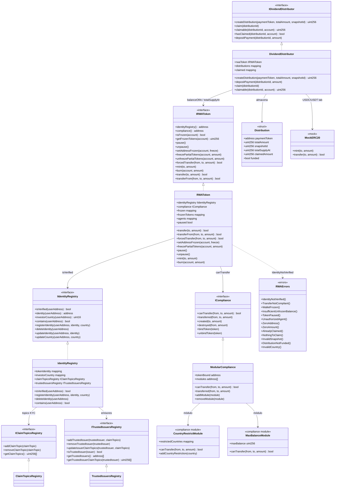

# Diagrama de clases — RWA Tokenization & Compliance Protocols

Vista estructural propuesta para el módulo 19 (ERC-3643 / T-REX + Identity Registry + yield).  
**Estado:** diseño previo a implementación · sync con `.cursorrules` local + suite.

> **Estándar de referencia:** token permissioned estilo ERC-3643 (T-REX): transferencias condicionadas a identidad verificada, compliance modular y recuperación forzosa por agente autorizado.

## Diagrama (Mermaid)



## Responsabilidades

| Artefacto | Responsabilidad |
|-----------|-----------------|
| `IdentityRegistry` | Registro de identidades ONCHAINID; `isVerified` exige claims de topics confiables |
| `ClaimTopicsRegistry` | Topics KYC/AML requeridos (p. ej. `KYC_CLAIM = 1`) |
| `TrustedIssuersRegistry` | Emisores de claims autorizados y topics que pueden firmar |
| `ModularCompliance` | Orquesta módulos (`canTransfer` + hooks post-transfer) |
| `RWAToken` | ERC-20 permissioned: transfer gated + freeze + pause + `forcedTransfer` |
| `DividendDistributor` | Distribuciones pro-rata por snapshot; claim de USDC/USDT |
| `RWAErrors` | Custom errors del módulo (`IdentityNotVerified` obligatorio) |

## Modelo de permisos en transferencia

```
  transfer / transferFrom
           │
           ▼
  ┌────────────────────┐
  │ ¿paused?           │──sí──► TokenPaused
  └─────────┬──────────┘
            │ no
            ▼
  ┌────────────────────┐
  │ ¿from/to frozen?   │──sí──► WalletFrozen
  └─────────┬──────────┘
            │ no
            ▼
  ┌────────────────────┐
  │ IdentityRegistry   │
  │ isVerified(from)   │──no──► IdentityNotVerified
  │ isVerified(to)     │──no──► IdentityNotVerified
  └─────────┬──────────┘
            │ sí
            ▼
  ┌────────────────────┐
  │ Compliance         │──no──► TransferNotCompliant
  │ canTransfer(...)   │
  └─────────┬──────────┘
            │ sí
            ▼
      _update balances
      compliance.transferred(...)
```

## Errores custom (diseño)

| Error | Uso |
|-------|-----|
| `IdentityNotVerified()` | `transfer` / `transferFrom` sin KYC en from o to |
| `TransferNotCompliant()` | Módulo de compliance rechaza el movimiento |
| `WalletFrozen()` | Dirección congelada total |
| `InsufficientUnfrozenBalance()` | Freeze parcial deja saldo libre insuficiente |
| `TokenPaused()` | Pause global activo |
| `UnauthorizedAgent()` | Caller no es agent/compliance manager |
| `AlreadyClaimed()` / `NothingToClaim()` | Ciclo de dividendos |
| `InvalidSnapshot()` / `DistributionNotFunded()` | Distribución mal formada o sin fondeo |
