# Diagrama de clases — RWA Tokenization & Compliance Protocols

Vista estructural alineada a la implementación v1 (módulo 19).  
**Sync:** 2026-09-15 · Fases **IDENT → SOLV** ✅ · `forge test` → **80 PASS**.

> **Estándar de referencia:** token permissioned estilo ERC-3643 (T-REX): KYC vía Identity Registry, compliance modular, freeze/pause, `forcedTransfer` y dividendos por snapshot.

## Diagrama (Mermaid)

```mermaid
classDiagram
    direction TB

    class IIdentityRegistry {
        <<interface>>
        +isVerified(userAddress) bool
        +identity(userAddress) address
        +investorCountry(userAddress) uint16
        +contains(userAddress) bool
        +registerIdentity(userAddress, identity, country)
        +deleteIdentity(userAddress)
        +updateIdentity(userAddress, identity)
        +updateCountry(userAddress, country)
        +claimTopicsRegistry() address
        +trustedIssuersRegistry() address
    }

    class IIdentity {
        <<interface>>
        +addClaim(topic, issuer)
        +removeClaim(topic)
        +getClaim(topic) issuer, valid
    }

    class IClaimTopicsRegistry {
        <<interface>>
        +addClaimTopic(claimTopic)
        +removeClaimTopic(claimTopic)
        +getClaimTopics() uint256[]
    }

    class ITrustedIssuersRegistry {
        <<interface>>
        +addTrustedIssuer(trustedIssuer, claimTopics)
        +removeTrustedIssuer(trustedIssuer)
        +updateIssuerClaimTopics(trustedIssuer, claimTopics)
        +isTrustedIssuer(issuer) bool
        +hasClaimTopic(issuer, claimTopic) bool
        +getTrustedIssuers() address[]
        +getTrustedIssuerClaimTopics(trustedIssuer) uint256[]
    }

    class ICompliance {
        <<interface>>
        +canTransfer(from, to, amount) bool
        +transferred(from, to, amount)
        +created(to, amount)
        +destroyed(from, amount)
        +bindToken(token)
        +tokenBound() address
    }

    class IComplianceModule {
        <<interface>>
        +canTransfer(from, to, amount) bool
        +transferred(from, to, amount)
        +created(to, amount)
        +destroyed(from, amount)
        +compliance() address
    }

    class IRWAToken {
        <<interface>>
        +identityRegistry() address
        +setIdentityRegistry(identityRegistry_)
        +compliance() address
        +setCompliance(compliance_)
        +isAgent(account) bool
        +paused() bool
        +pause()
        +unpause()
        +isFrozen(account) bool
        +getFrozenTokens(account) uint256
        +getFreeBalance(account) uint256
        +setAddressFrozen(account, freeze)
        +freezePartialTokens(account, amount)
        +unfreezePartialTokens(account, amount)
        +forcedTransfer(from, to, amount) bool
        +mint(to, amount)
        +burn(account, amount)
        +snapshot() uint256
        +currentSnapshotId() uint256
        +balanceOfAt(account, snapshotId) uint256
        +totalSupplyAt(snapshotId) uint256
    }

    class IDividendDistributor {
        <<interface>>
        +rwaToken() address
        +createDistribution(paymentToken, totalAmount, snapshotId) uint256
        +depositPayment(distributionId)
        +claim(distributionId)
        +claimable(distributionId, account) uint256
        +hasClaimed(distributionId, account) bool
        +distributionCount() uint256
    }

    class RWAErrors {
        <<errors library>>
        +IdentityNotVerified()
        +TransferNotCompliant()
        +WalletFrozen()
        +InsufficientUnfrozenBalance()
        +InsufficientBalance()
        +TokenPaused()
        +TokenNotPaused()
        +UnauthorizedAgent()
        +AlreadyClaimed()
        +NothingToClaim()
        +InvalidSnapshot()
        +InvalidDistribution()
        +DistributionNotFunded()
        +AlreadyFunded()
        +ModuleAlreadyAdded()
        +TokenAlreadyBound()
        +OnlyBoundToken()
        +OnlyCompliance()
    }

    class Identity {
        +addClaim(topic, issuer)
        +removeClaim(topic)
        +getClaim(topic) issuer, valid
    }

    class IdentityRegistry {
        +isVerified(userAddress) bool
        +registerIdentity(userAddress, identity, country)
        +deleteIdentity(userAddress)
        +updateIdentity(userAddress, identity)
        +updateCountry(userAddress, country)
        +contains(userAddress) bool
    }

    class ClaimTopicsRegistry {
        +addClaimTopic(claimTopic)
        +removeClaimTopic(claimTopic)
        +getClaimTopics() uint256[]
    }

    class TrustedIssuersRegistry {
        +addTrustedIssuer(issuer, claimTopics)
        +removeTrustedIssuer(issuer)
        +isTrustedIssuer(issuer) bool
        +hasClaimTopic(issuer, topic) bool
    }

    class ModularCompliance {
        +bindToken(token)
        +addModule(module)
        +removeModule(module)
        +getModules() address[]
        +canTransfer(from, to, amount) bool
        +transferred(from, to, amount)
        +created(to, amount)
        +destroyed(from, amount)
        +tokenBound() address
    }

    class CountryRestrictModule {
        +identityRegistry IIdentityRegistry
        +setCountryRestricted(country, restricted)
        +isCountryRestricted(country) bool
        +canTransfer(from, to, amount) bool
    }

    class MaxBalanceModule {
        +token address
        +maxBalance uint256
        +setMaxBalance(maxBalance_)
        +canTransfer(from, to, amount) bool
    }

    class RWAToken {
        +AGENT_ROLE bytes32
        +mint(to, amount)
        +burn(account, amount)
        +forcedTransfer(from, to, amount) bool
        +pause() / unpause()
        +setAddressFrozen(account, freeze)
        +freezePartialTokens / unfreezePartialTokens
        +snapshot() uint256
        +balanceOfAt / totalSupplyAt
        +setCompliance(compliance_)
        +getFreeBalance(account) uint256
    }

    class DividendDistributor {
        +createDistribution(paymentToken, totalAmount, snapshotId) uint256
        +depositPayment(distributionId)
        +claim(distributionId)
        +claimable(distributionId, account) uint256
        +getDistribution(distributionId) ...
    }

    class Distribution {
        <<struct>>
        +address paymentToken
        +uint256 totalAmount
        +uint256 snapshotId
        +uint256 totalSupplyAt
        +uint256 claimedAmount
        +bool funded
    }

    class MockERC20 {
        <<mock>>
        +mint(to, amount)
        +decimals() uint8
    }

    IIdentityRegistry <|.. IdentityRegistry
    IIdentity <|.. Identity
    IClaimTopicsRegistry <|.. ClaimTopicsRegistry
    ITrustedIssuersRegistry <|.. TrustedIssuersRegistry
    ICompliance <|.. ModularCompliance
    IComplianceModule <|.. CountryRestrictModule
    IComplianceModule <|.. MaxBalanceModule
    IRWAToken <|.. RWAToken
    IDividendDistributor <|.. DividendDistributor

    IdentityRegistry --> IClaimTopicsRegistry : topics KYC
    IdentityRegistry --> ITrustedIssuersRegistry : emisores
    IdentityRegistry --> IIdentity : getClaim
    ModularCompliance --> IComplianceModule : AND canTransfer
    CountryRestrictModule --> IIdentityRegistry : investorCountry
    MaxBalanceModule --> RWAToken : balanceOf
    RWAToken --> IIdentityRegistry : isVerified
    RWAToken --> ICompliance : canTransfer / hooks
    RWAToken ..> RWAErrors : IdentityNotVerified
    DividendDistributor --> IRWAToken : balanceOfAt / totalSupplyAt
    DividendDistributor --> Distribution : almacena
    DividendDistributor --> MockERC20 : USDC lab
```



## Responsabilidades

| Artefacto | Responsabilidad |
|-----------|-----------------|
| `Identity` | Claims lab (topic → issuer) gestionados por owner |
| `IdentityRegistry` | Alta/baja; `isVerified` = registrado + claims de trusted issuers |
| `ClaimTopicsRegistry` | Topics KYC/AML obligatorios |
| `TrustedIssuersRegistry` | Emisores confiables + topics autorizados |
| `ModularCompliance` | `bindToken` + AND de módulos + hooks solo desde token |
| `CountryRestrictModule` | Bloquea `from`/`to` con país restringido |
| `MaxBalanceModule` | Cap `balanceOf(to) + amount ≤ maxBalance` |
| `RWAToken` | ERC-20 permissioned: KYC, pause, freeze, forced, snapshots, compliance |
| `DividendDistributor` | create → deposit → claim pro-rata (CEI + reentrancy) |
| `MockERC20` | USDC lab (6 decimals) |
| `RWAErrors` | Custom errors del módulo |

## Modelo de permisos en transferencia

```
  transfer / transferFrom  (y mint vía canTransfer(0,to,amount) si hay compliance)
           │
           ▼
  ┌────────────────────┐
  │ ¿paused?           │──sí──► TokenPaused
  └─────────┬──────────┘
            │ no
            ▼
  ┌────────────────────┐
  │ ¿from/to frozen?   │──sí──► WalletFrozen
  └─────────┬──────────┘
            │ no
            ▼
  ┌────────────────────┐
  │ isVerified(from/to)│──no──► IdentityNotVerified
  └─────────┬──────────┘
            │ sí
            ▼
  ┌────────────────────┐
  │ free balance OK?   │──no──► InsufficientUnfrozenBalance
  └─────────┬──────────┘
            │ sí
            ▼
  ┌────────────────────┐
  │ compliance bound?  │──no──► skip
  │ canTransfer(...)   │──fail─► TransferNotCompliant
  └─────────┬──────────┘
            │ ok
            ▼
      _update balances
      compliance.transferred / created / destroyed
```

> `forcedTransfer`: bypassa pause, freeze e `isVerified(from)` y `canTransfer`; exige `isVerified(to)` y `to` no frozen; luego ejecuta hook `transferred` si hay compliance.

## Roles

| Rol | Mecanismo | Acciones |
|-----|-----------|----------|
| Admin | `DEFAULT_ADMIN_ROLE` | `addAgent`, `setIdentityRegistry`, `setCompliance` |
| Agent | `AGENT_ROLE` | mint/burn, pause, freeze, snapshot, `forcedTransfer` |
| Identity owner | `Ownable2Step` en registries | registerIdentity, topics, issuers |
| Dividend manager | `Ownable2Step` en distributor | createDistribution, depositPayment |
| Holder | — | transfer (si KYC+compliance), claim |

## Errores custom (implementados)

| Error | Uso |
|-------|-----|
| `IdentityNotVerified()` | transfer/mint/forced destino sin KYC |
| `TransferNotCompliant()` | módulo compliance rechaza |
| `WalletFrozen()` | freeze total en from/to (o destino de forced) |
| `InsufficientUnfrozenBalance()` | saldo libre insuficiente / unfreeze excesivo |
| `InsufficientBalance()` | forcedTransfer sin balance total |
| `TokenPaused()` / `TokenNotPaused()` | pause / unpause inválido |
| `UnauthorizedAgent()` | `forcedTransfer` sin `AGENT_ROLE` |
| `AlreadyClaimed()` / `NothingToClaim()` | ciclo de dividendos |
| `InvalidSnapshot()` / `InvalidDistribution()` | snapshot o id de distribución inválido |
| `DistributionNotFunded()` / `AlreadyFunded()` | claim sin fondeo / doble deposit |
| `ModuleAlreadyAdded()` / `ModuleNotFound()` | gestión de módulos |
| `TokenAlreadyBound()` / `OnlyBoundToken()` / `OnlyCompliance()` | binding compliance |
