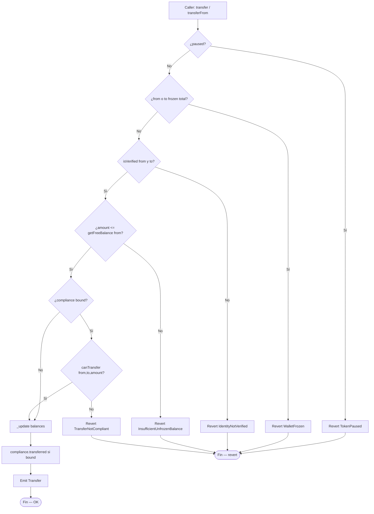
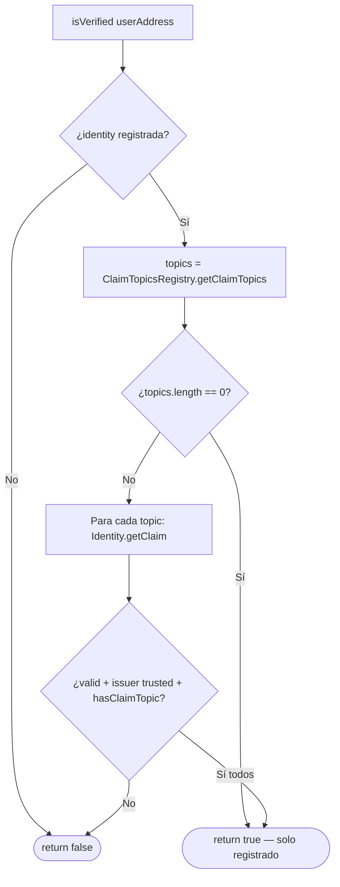
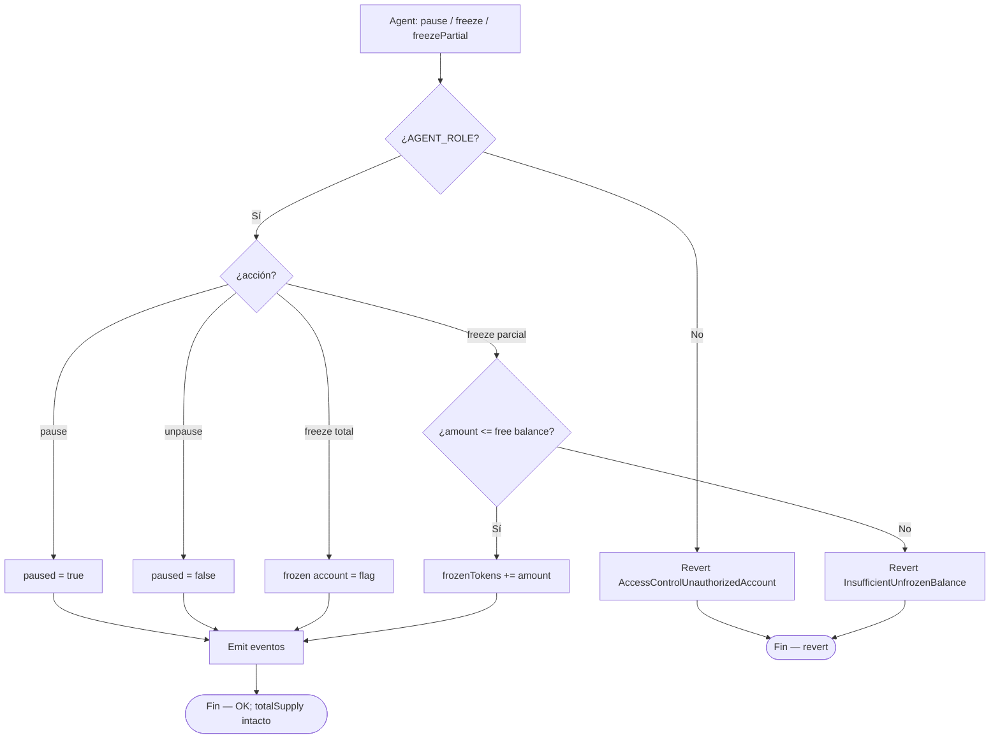
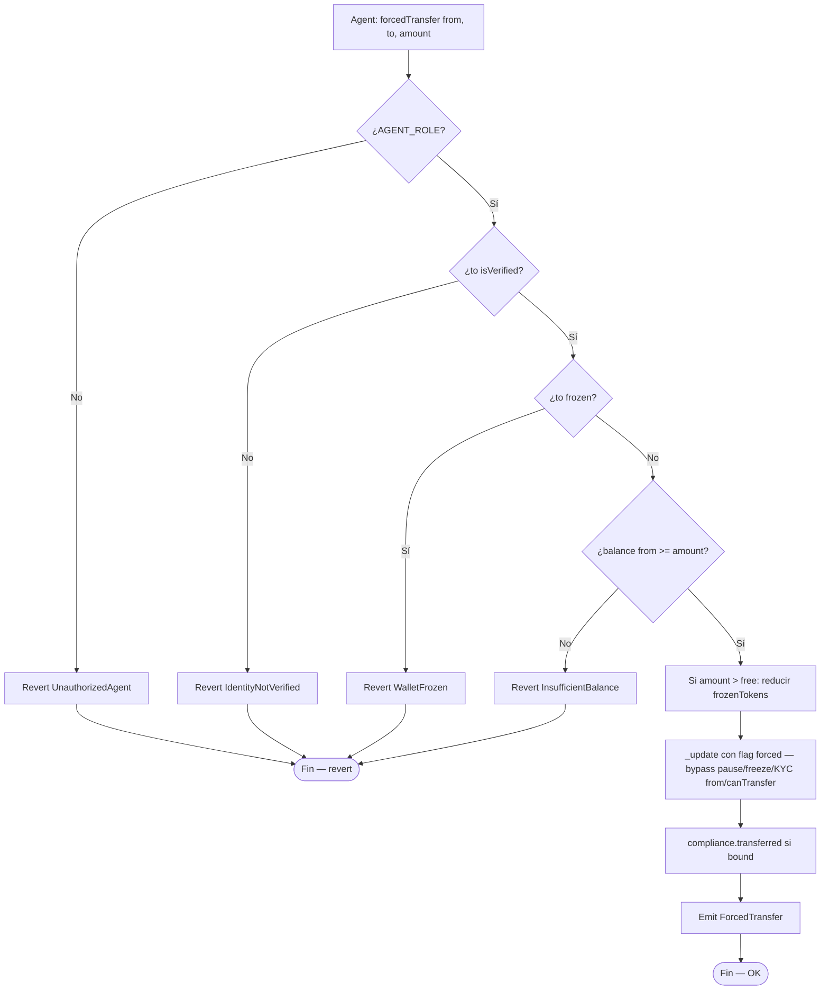
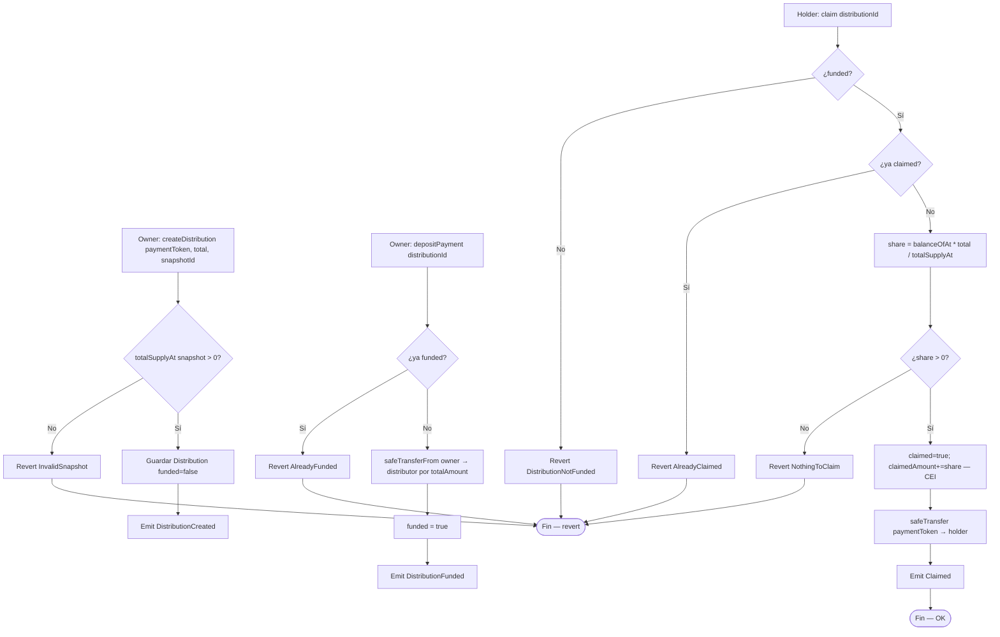
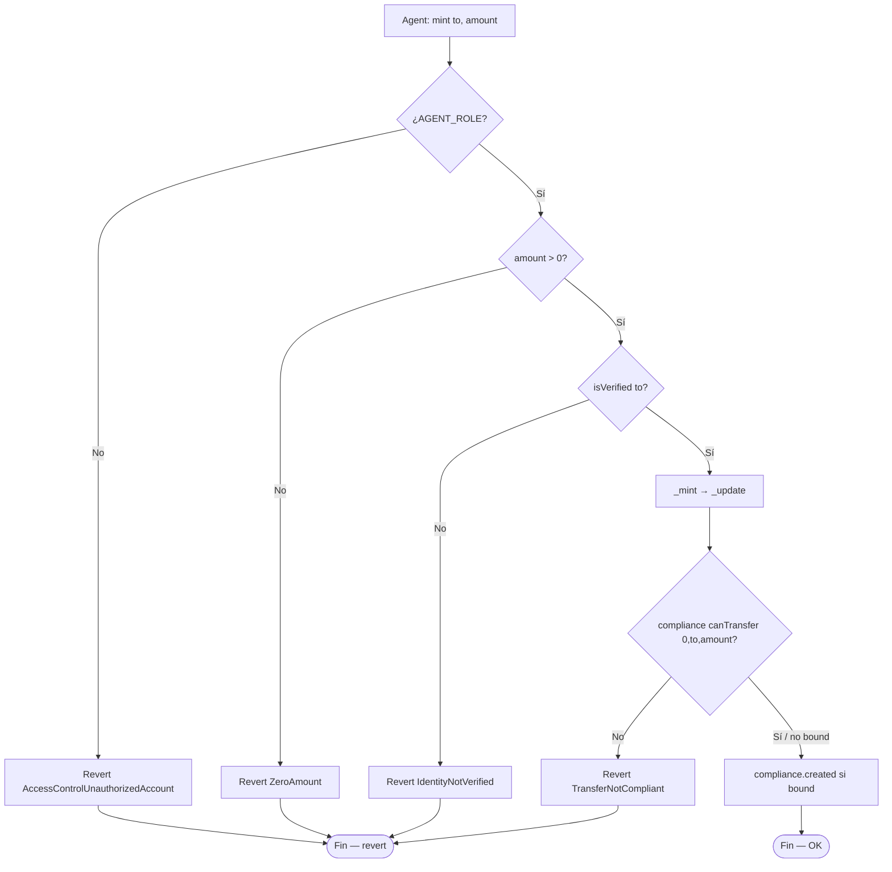

# Diagrama de flujo — Identity, transfers, freeze, compliance y dividendos

Flujos de decisión internos del protocolo RWA (módulo 19, **v1 implementado**).  
**Sync:** 2026-09-15 · Fases **IDENT → SOLV** ✅ · 80 PASS.

## 1. transfer / transferFrom (permissioned)

> Orden real en `_update`: pause → freeze → KYC → free balance → compliance.  
> Si `compliance == address(0)`, se omite `canTransfer` / hooks.

---

## 2. isVerified (Identity Registry)

> Lab: claims los escribe el owner de `Identity` (`addClaim`). No hay verificación criptográfica ONCHAINID de producción.

---

## 3. Freeze total / parcial y pause global

> Pause/freeze usan `onlyRole(AGENT_ROLE)` (error OZ AccessControl).  
> `forcedTransfer` usa `UnauthorizedAgent` explícito.

---

## 4. forcedTransfer (recuperación)

---

## 5. Dividendos — createDistribution → depositPayment → claim

> `depositPayment(distributionId)` **no** recibe amount: siempre transfiere `totalAmount`.  
> Flooring: `Σ claims ≤ totalAmount` (dust puede quedar en el contrato).

---

## 6. mint (agent → verificado)

> Mint **no** se bloquea por pause global (solo transfers wallet↔wallet). MaxBalanceModule sí puede rechazar mint.
