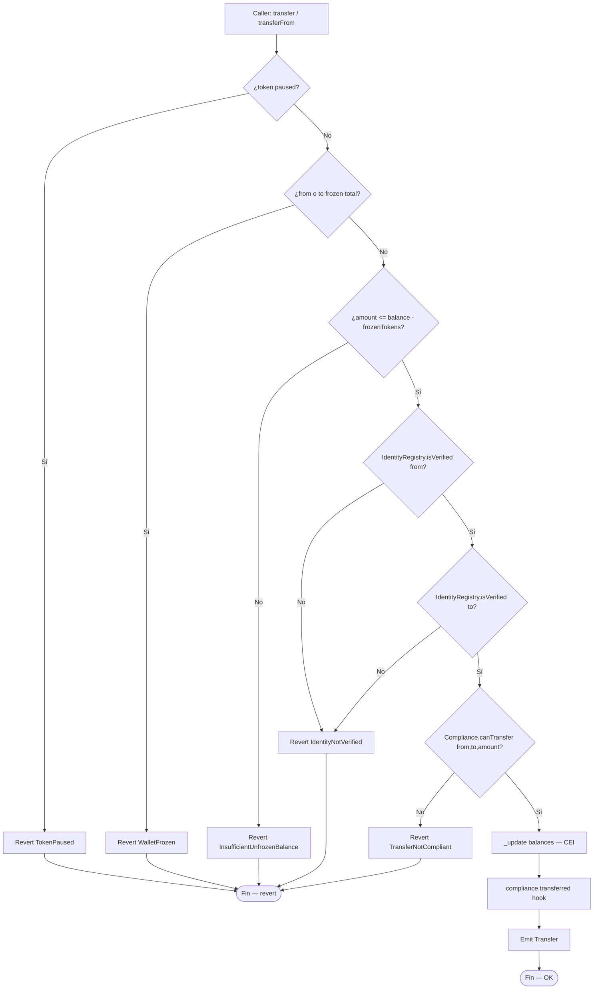
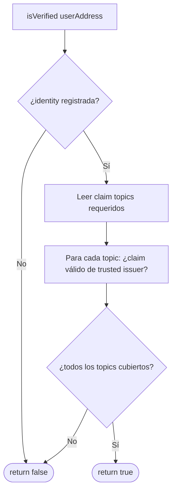
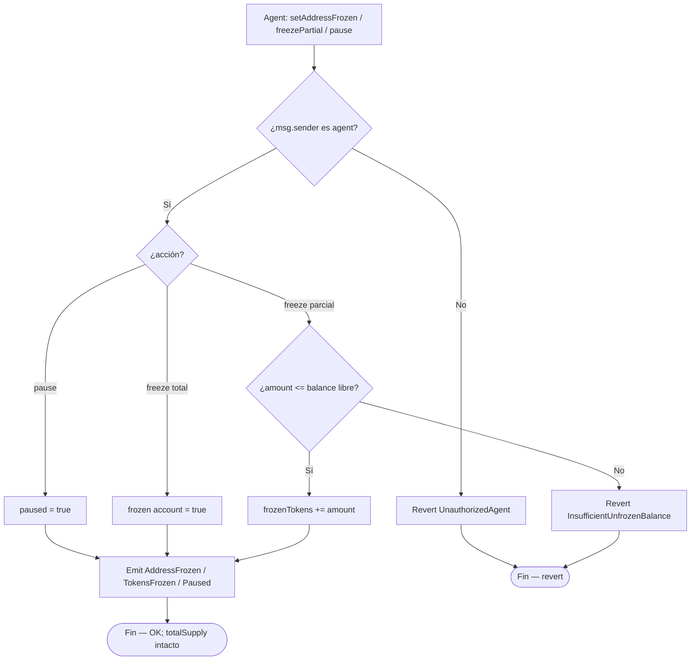
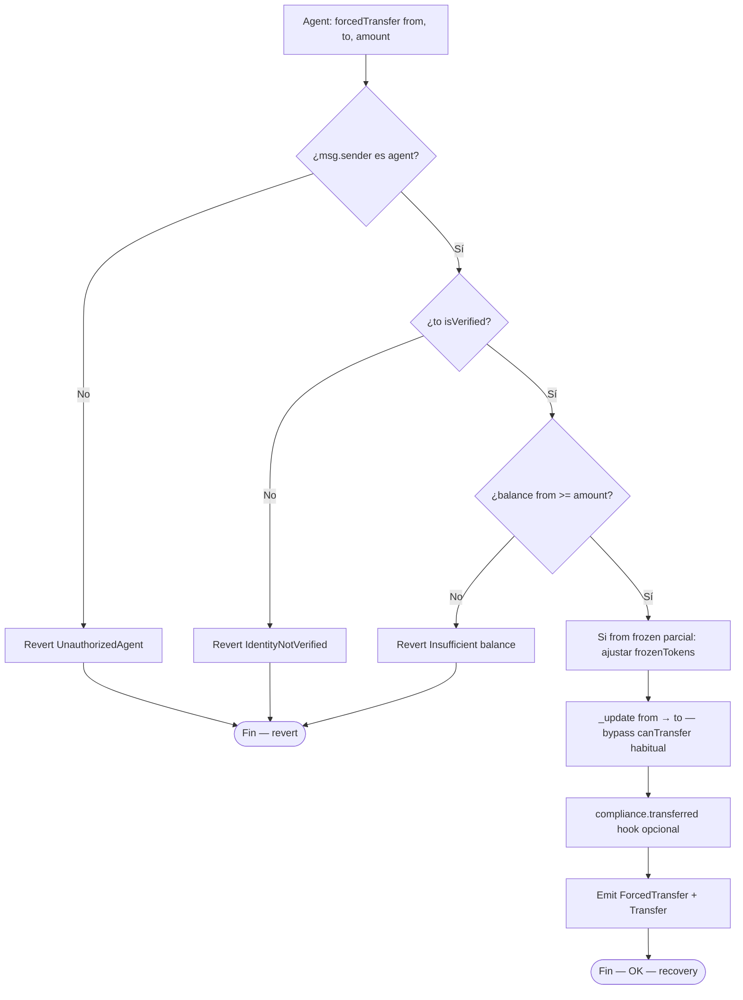
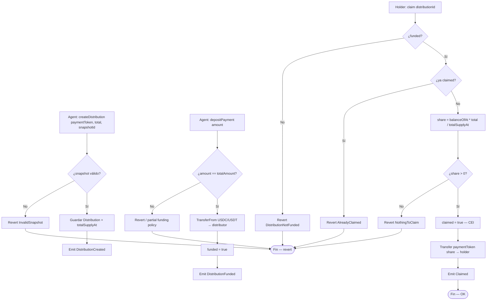
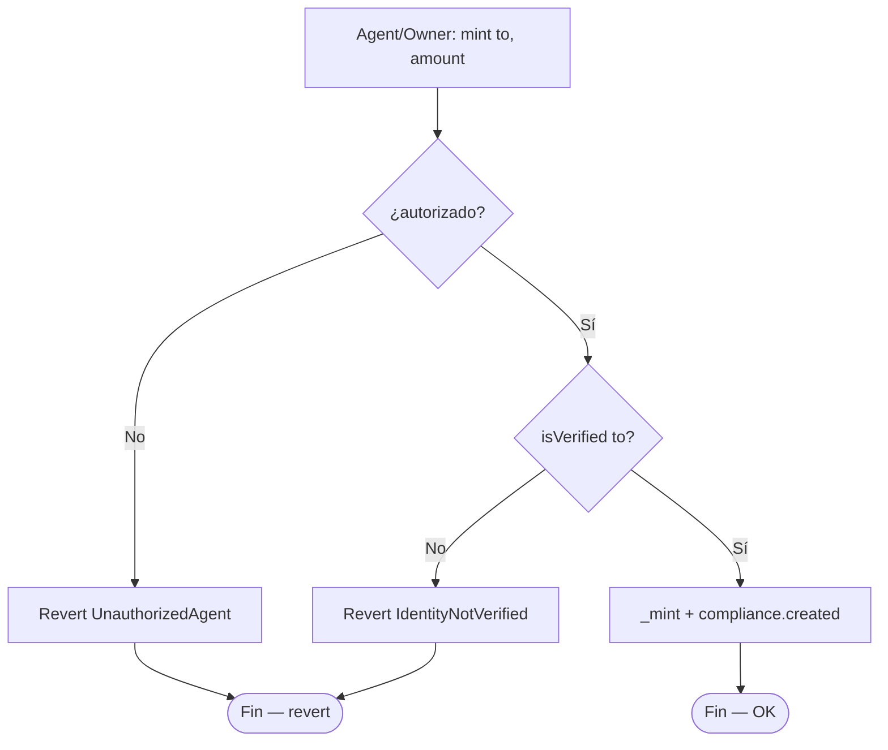

# Diagrama de flujo — Identity, transfers, freeze y dividendos

Flujos de decisión internos del protocolo RWA (módulo 19, **v1 implementado**).  
**Sync:** 2026-09-14 · Fases **IDENT → SOLV** ✅ · 80 PASS.

## 1. transfer / transferFrom (permissioned)

> Obligatorio del módulo: **toda** transferencia ejecuta `isVerified` antes de mover tokens.  
> CEI: actualizar estado **antes** de hooks externos de compliance si el módulo hace llamadas externas.

---

## 2. isVerified (Identity Registry)

> En lab v1 se puede simplificar a `mapping` de identidades + flag verificado, siempre que la API pública exponga `isVerified` y los tests de no-KYC reviertan con `IdentityNotVerified()`.

---

## 3. Freeze total / parcial y pause global

> Freeze y pause **no** alteran `totalSupply`. Solo restringen movimiento.

---

## 4. forcedTransfer (recuperación / orden judicial)

> El destino **debe** ser identidad verificada (nueva wallet KYC). El origen puede estar frozen/perdido.

---

## 5. Dividendos — createDistribution → deposit → claim

> Pro-rata por holdings en snapshot. Tests deben cubrir proporciones distintas y ausencia de over-claim / dust excesivo.

---

## 6. mint (solo a verificados)

