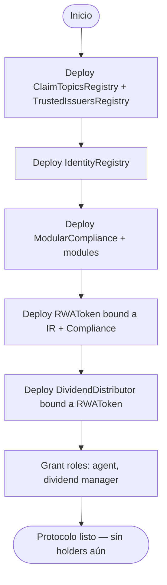
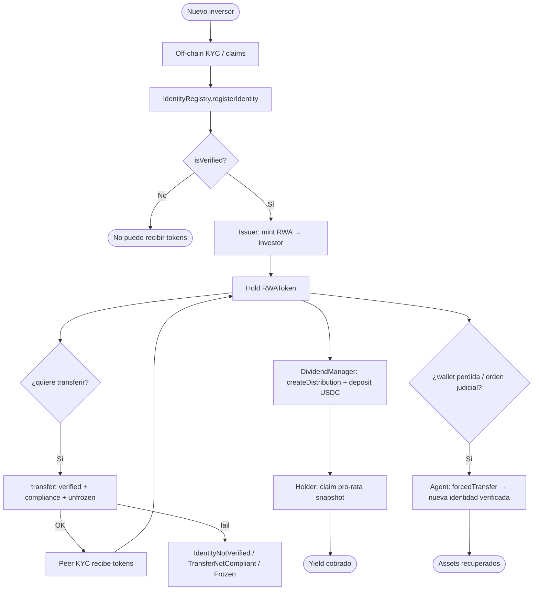
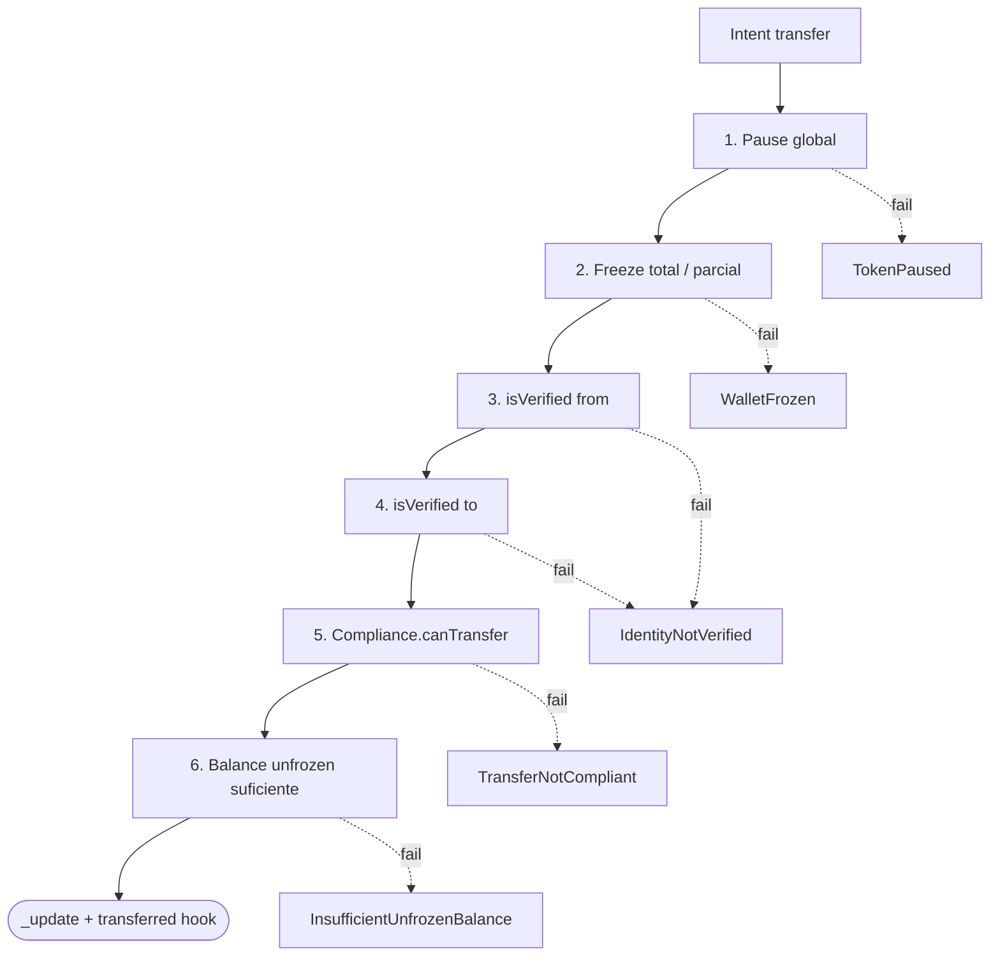
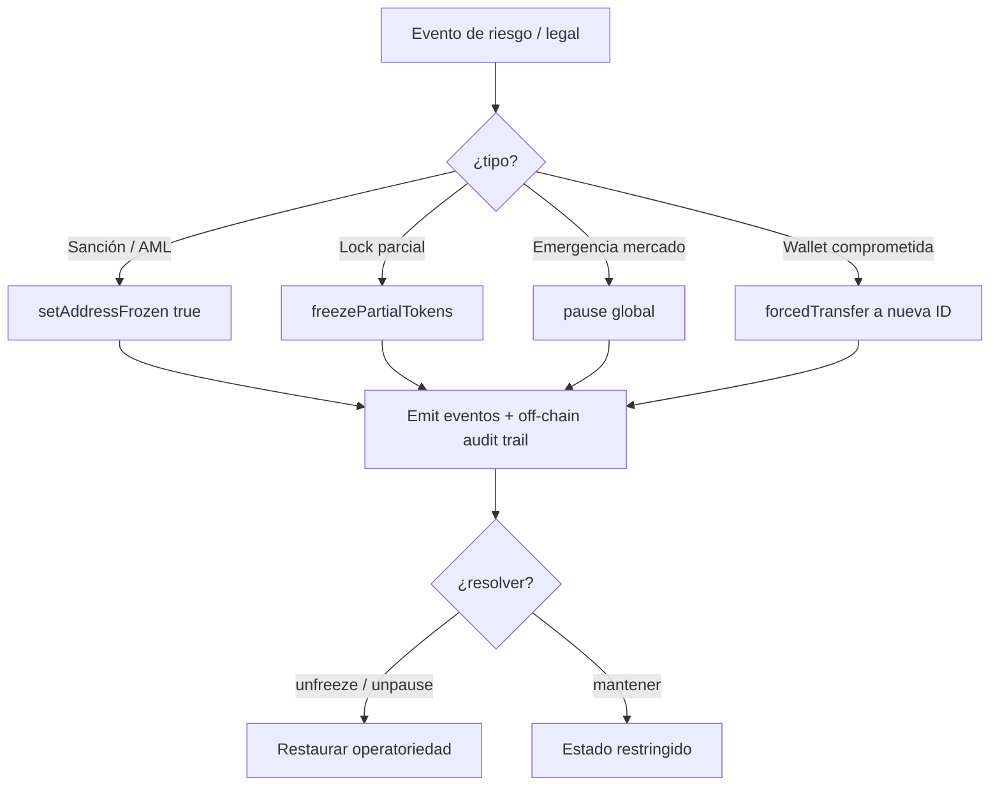
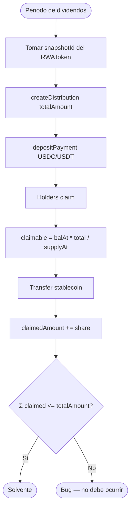
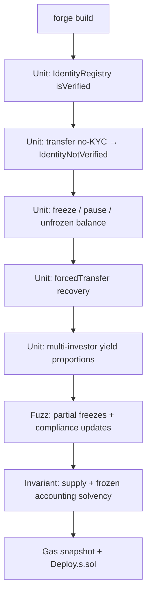

# Flujograma — Ciclo completo RWA Tokenization & Compliance

Flujo extremo a extremo entre inversores KYC, registro de identidades, token permissioned, agente de compliance y distribución de yield (módulo 19, **diseño**).

## Actores

| Actor | Rol |
|-------|-----|
| Emisor / Issuer | Despliega token RWA; configura compliance e identity |
| Investor KYC | Wallet verificada; puede recibir, transferir y claim dividendos |
| Investor no-KYC | Sin identidad; toda transferencia revertirá |
| Claim Issuer | Emite claims ONCHAINID (topics KYC/AML) |
| Compliance Agent | Freeze, pause, `forcedTransfer`, gestiona módulos |
| Dividend Manager | Crea y fondea distribuciones USDC/USDT |
| ModularCompliance | Evalúa reglas (país, max balance, etc.) |
| IdentityRegistry | Fuente de verdad de `isVerified` |
| CI / Foundry | Unit compliance, yield accuracy, recovery, fuzz locks |

---

## Flujograma — Deploy y wiring

---

## Flujograma principal — Onboard → Hold → Transfer → Yield → Recovery

---

## Flujograma — Capas de defensa en transferencia

---

## Flujograma — Compliance agent lifecycle

---

## Flujograma — Contabilidad de yield (snapshot)

---

## Flujograma — Tooling Foundry (lab)

---

## Relación con otros docs

| Documento | Contenido |
|-----------|-----------|
| [diagrama-de-clases.md](./diagrama-de-clases.md) | Contratos, interfaces, módulos compliance |
| [diagrama-de-flujo.md](./diagrama-de-flujo.md) | Decisiones internas por función |
| [planificacion.md](./planificacion.md) | Fases por dominio RWA (autorización por fase) |
