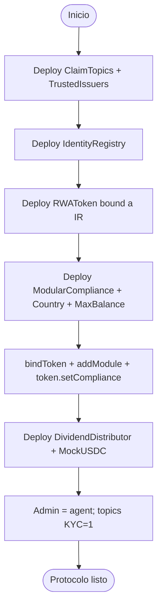
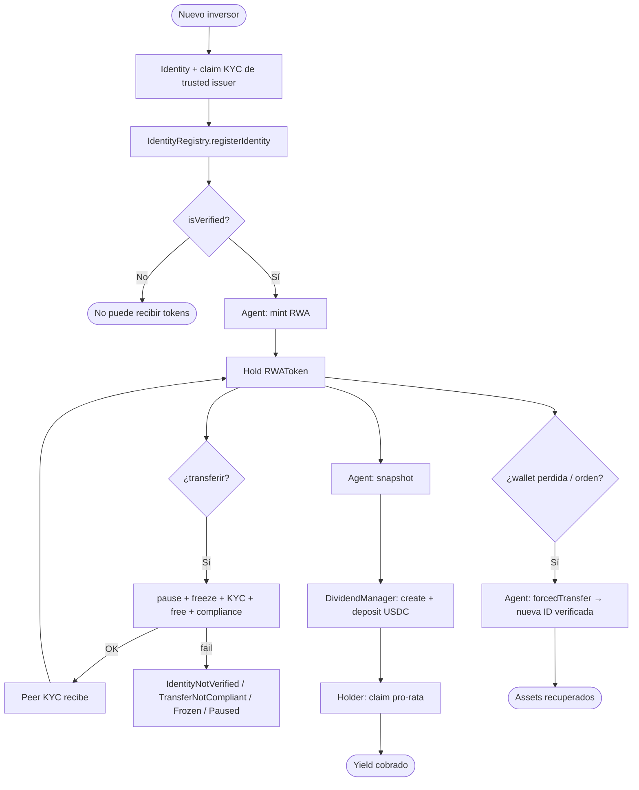
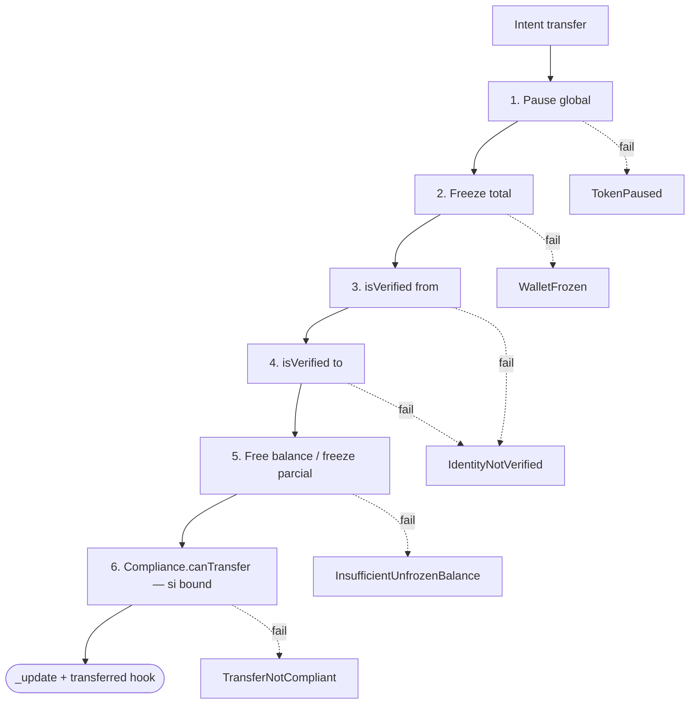
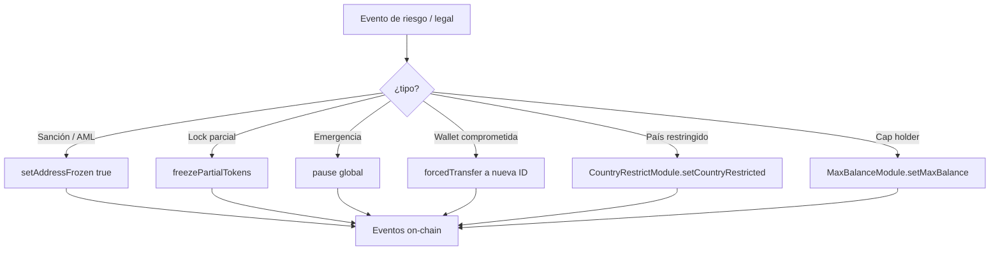
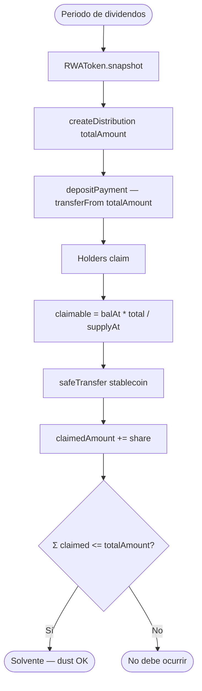
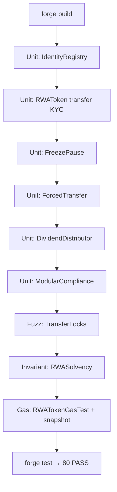

# Flujograma — Ciclo completo RWA Tokenization & Compliance

Flujo extremo a extremo (módulo 19, **v1 implementado**).  
**Sync:** 2026-09-15 · Fases **IDENT → SOLV** ✅ · 80 PASS.

## Actores

| Actor | Rol |
|-------|-----|
| Emisor / Admin | Deploy; `DEFAULT_ADMIN_ROLE`; configura IR, compliance, agents |
| Agent | mint/burn, pause, freeze, snapshot, `forcedTransfer` |
| Claim Issuer | Emisor confiable de claims KYC (lab) |
| Investor KYC | Wallet verificada; hold, transfer, claim dividendos |
| Investor no-KYC | Sin identidad; transfer/mint revierten |
| ModularCompliance | AND de módulos país / max balance |
| IdentityRegistry | Fuente de `isVerified` + `investorCountry` |
| Dividend manager | Owner del `DividendDistributor` |
| CI / Foundry | Unit, fuzz locks, invariantes, gas, SWC |

---

## Flujograma — Deploy y wiring (v1)

> Script: `script/Deploy.s.sol`. Env: `.env.example` (`TOKEN_NAME`, `TOKEN_SYMBOL`, `MAX_BALANCE`).

---

## Flujograma principal — Onboard → Hold → Transfer → Yield → Recovery

---

## Flujograma — Capas de defensa en transferencia

---

## Flujograma — Compliance agent lifecycle

---

## Flujograma — Contabilidad de yield (snapshot)

---

## Flujograma — Tooling Foundry (lab)

---

## Relación con otros docs

| Documento | Contenido |
|-----------|-----------|
| [diagrama-de-clases.md](./diagrama-de-clases.md) | Contratos, interfaces, módulos (API real) |
| [diagrama-de-flujo.md](./diagrama-de-flujo.md) | Decisiones internas por función |
| [planificacion.md](./planificacion.md) | Fases IDENT→SOLV cerradas |
| [SWC-AUDIT.md](./SWC-AUDIT.md) | Matriz SWC-100–136 |
| [GAS.md](./GAS.md) | Baseline gas |
